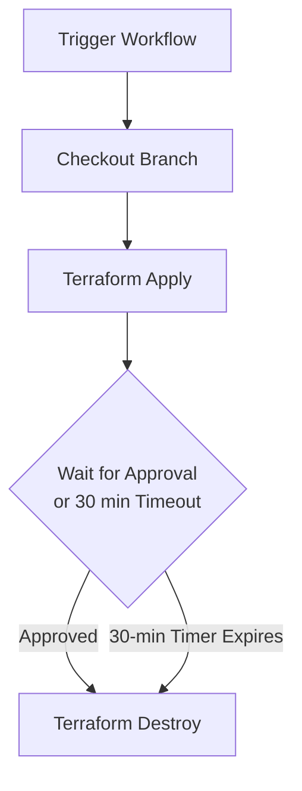

# Azure App Service Web App Example Deployment

This directory contains a complete, runnable example for deploying an Azure Linux Web App using the root module. It is designed to be utilized locally for testing and integrated with the GitHub Actions CI/CD workflow for automated apply and destroy scenarios.

## Resources Created
When applied, this example provisions:
1. **Resource Group**: `rg-webapp-example-deploy` (located in `Central India`).
2. **App Service Plan**: `asp-webapp-example-deploy` (B1 Basic plan, Linux).
3. **App Service (Linux Web App)**: Named using the naming convention of the module (e.g. `app-ot-dev-test-centralindia-examplewebapp-<suffix>`).

---

## Local Usage

To test the deployment locally, you need the Azure CLI (`az`) installed and authenticated.

### 1. Authenticate to Azure
```bash
az login
```

### 2. Run Terraform Commands
Initialize and apply the configuration:
```bash
# Initialize Terraform and fetch plugins/modules
terraform init

# Generate and review the execution plan
terraform plan

# Apply the configuration to create resources
terraform apply -auto-approve
```

### 3. Cleanup Resources
To destroy all provisioned resources:
```bash
terraform destroy -auto-approve
```

---

## GitHub Actions Auto-Destroy Workflow

A manual pipeline is available in this repository at [.github/workflows/terraform.yml](../.github/workflows/terraform.yml) to deploy these resources and automatically clean them up.

### Prerequisites

You must configure the following GitHub Repository Secrets for Azure Authentication:
- `AZURE_CLIENT_ID`
- `AZURE_TENANT_ID`
- `AZURE_SUBSCRIPTION_ID`
- `AZURE_CLIENT_SECRET` (if not using OIDC federated credentials)

### How to Run

1. Go to the **Actions** tab of your repository on GitHub.
2. Select the **Terraform Deploy and Auto-Destroy** workflow.
3. Click the **Run workflow** dropdown.
4. Select or type the target branch to deploy (defaults to `main`).
5. Click **Run workflow**.

### Workflow Behavior


- **Terraform Apply**: The workflow checks out the selected branch and runs `terraform apply`.
- **Manual Gate**: The workflow pauses using the `trstringer/manual-approval` action and creates a GitHub issue in the repository.
- **Auto-Destroy**:
  - If a user comments `/approve` (or clicks approve) on the issue, the resource is immediately destroyed.
  - If no action is taken after **30 minutes**, the approval step times out, and the workflow automatically proceeds to destroy the resources.